# 06. 아키텍처 그림 (팀원 설명용)

> **한 줄 요약:** 우리 서비스는 **서버 한 대(단일 서버)** 가 중심이고, 그 서버가 DB, Redis, 이미지 저장소, 메일 서버를 부르는 단순한 구조입니다. 서비스가 여러 개로 쪼개진 MSA가 아니라서 그림도 상자 몇 개와 화살표면 충분합니다.
> 상태: **가안**입니다. 그림은 이미지 파일(`그림/` 폴더)이라 어디서 열어도 그림으로 보입니다.
> 글자로 된 상세 그림(조회수 집계, 인기 검색어 등)은 [기술스택-아키텍처.md](../기술스택-아키텍처.md) 3장에 있습니다.
> 읽는 순서는 [00-목차.md](00-목차.md)를 봅니다.

## 1. 전체 구성도: 요청이 지나가는 길

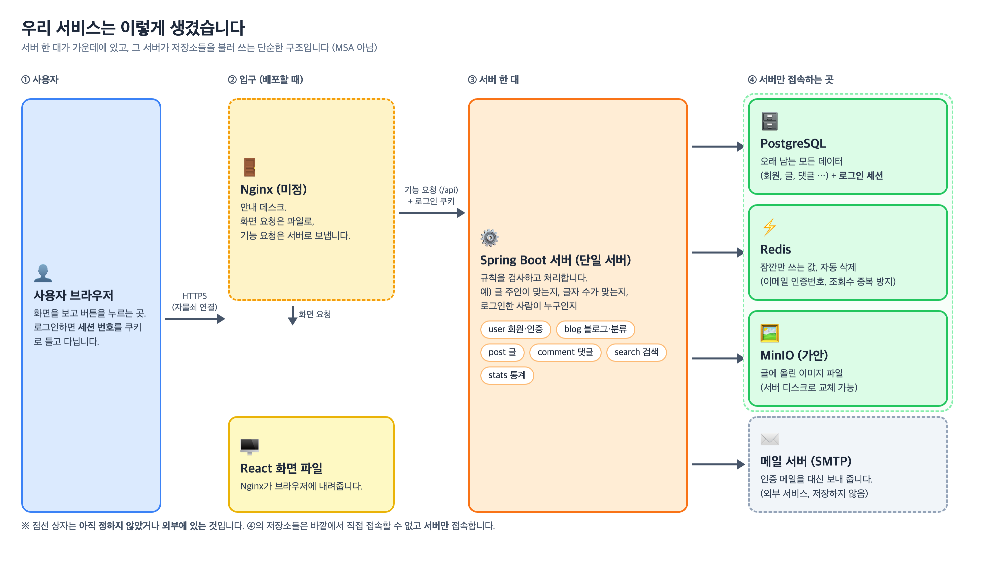

- 안쪽 4개(PostgreSQL, Redis, MinIO, 메일)는 **서버만 접속**하고 바깥에서 직접 접속하지 못하게 합니다.
- Nginx는 배포 환경에 따라 필요 여부가 정해집니다. 개발 중에는 쓰지 않습니다.

## 2. 데이터 지도: 무엇이 어디에 저장되나

| 저장소 | 저장되는 것 | 얼마나 오래 |
|---|---|---|
| **PostgreSQL** | 회원(해시된 비밀번호, 로그인 실패 횟수), 블로그, 분류, 글(마크다운 글자), 댓글, 일별 통계, 이미지 주소 기록, **로그인 세션** | 영구 (세션은 마지막 사용 후 7일) |
| **Redis** | 이메일 인증번호, "인증됨" 표시, 재발송 제한, 조회수 중복 방지, 방문자 하루 1번 표시 | 10분~하루, **자동 삭제** |
| **MinIO** (가안) | 이미지 파일 본체 | 글을 지우면 같이 삭제 |
| **브라우저 쿠키** | 로그인 세션 번호 (스크립트가 읽지 못하게 `HttpOnly`) | 로그아웃하거나 만료될 때까지 |
| **메일 서버** | 인증 메일 (저장하지 않고 보내기만 함) | — |

## 3. 서버 안의 구조

### 3-1. 요청이 처리되는 순서

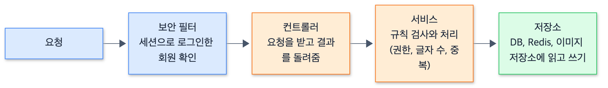

그림 원본 보기 (그림을 고칠 때만 필요)

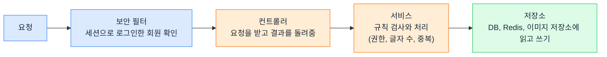

핵심 규칙(누가 고칠 수 있나, 글자 수 제한 등)은 **서비스**에서 검사합니다. 화면의 검사는 보조입니다.

### 3-2. 기능별 모듈과 부르는 방향 (가안)

서버는 기능별로 폴더(모듈)를 나눕니다. **화살표 방향으로만 부를 수 있고, 반대 방향이나 서로 부르는 순환은 하지 않습니다.**

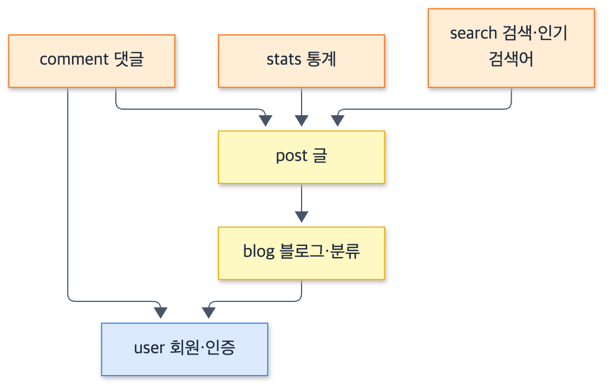

그림 원본 보기 (그림을 고칠 때만 필요)

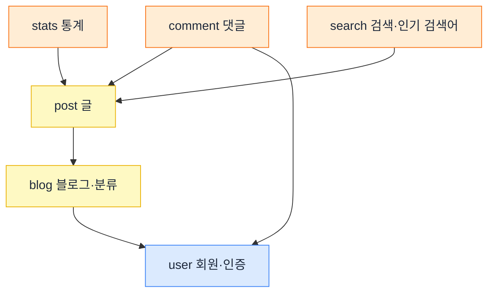

예를 들어 댓글은 글을 알아야 하지만, 글은 댓글을 몰라도 됩니다. 이렇게 하면 한 부분을 고쳐도 다른 부분이 덜 흔들립니다.

## 4. 핵심 흐름 3가지

### 4-1. 회원가입과 이메일 인증 (가입하기 **전에** 인증)

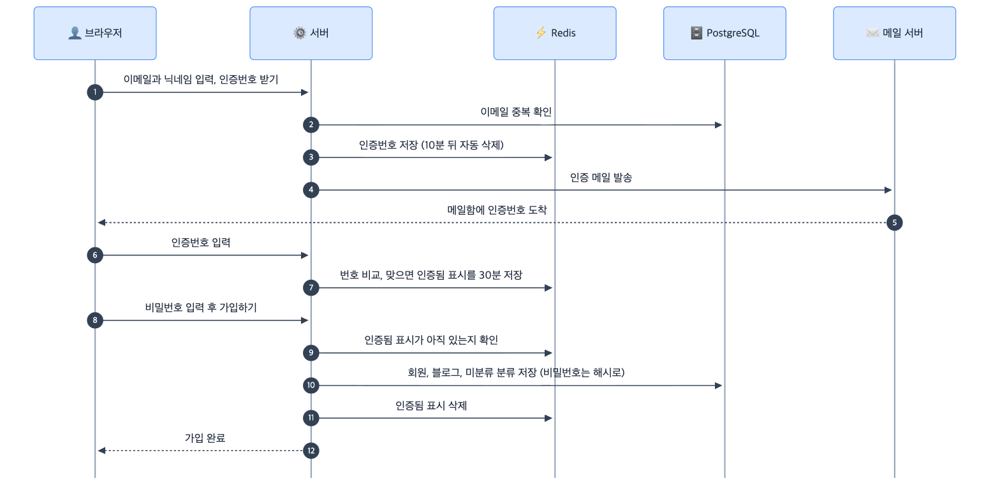

그림 원본 보기 (그림을 고칠 때만 필요)

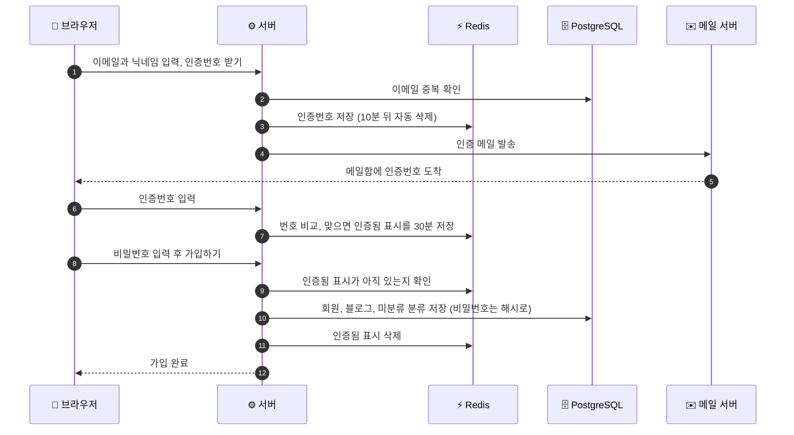

### 4-2. 로그인과 세션

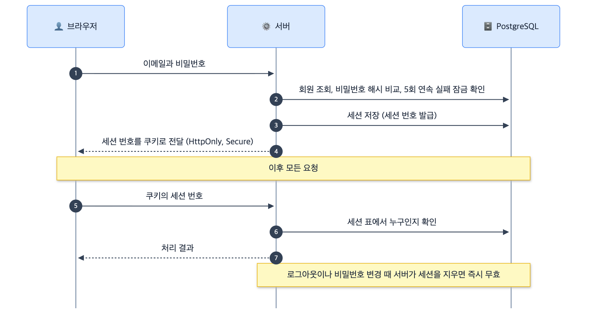

그림 원본 보기 (그림을 고칠 때만 필요)

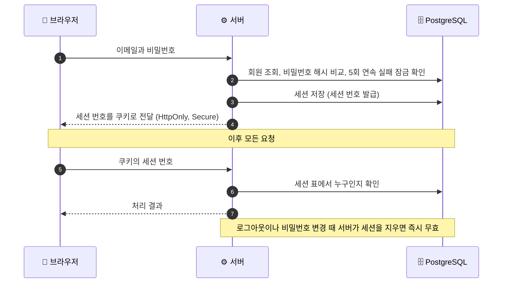

### 4-3. 글 작성과 이미지 업로드

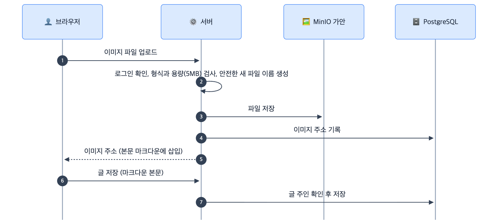

그림 원본 보기 (그림을 고칠 때만 필요)

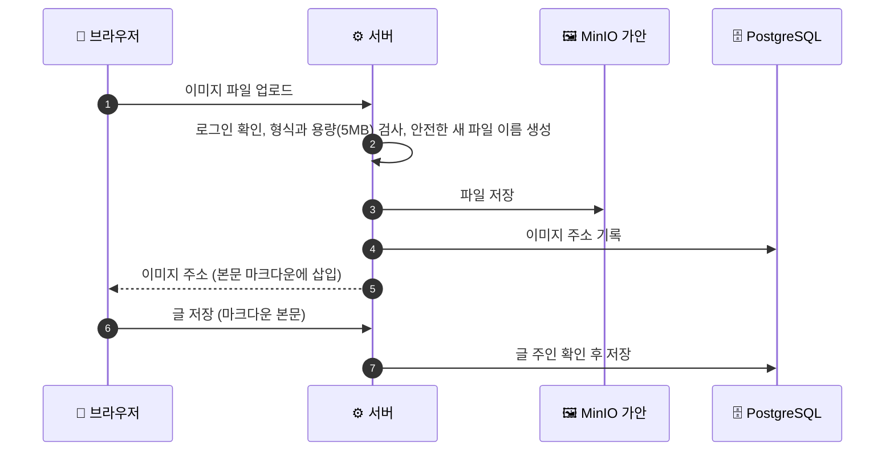

조회수와 방문자 집계, 실시간 인기 검색어 흐름은 [기술스택-아키텍처.md](../기술스택-아키텍처.md) 3장 F, G에 있습니다.

## 5. 개발과 배포 환경

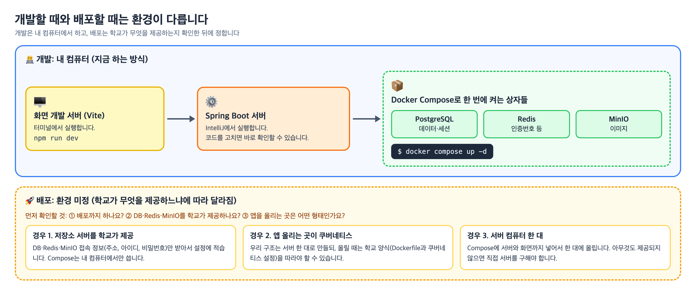

- 개발 방법은 [03-로컬환경-도커컴포즈-사용법.md](03-로컬환경-도커컴포즈-사용법.md), 배포는 [05-배포-준비.md](05-배포-준비.md)에 있습니다.

## 6. 그림으로 정리하며 정한 것 (가안)

| 확인할 것 | 정한 값 (추천) | 상태 |
|---|---|---|
| 글 주인 본인의 조회를 조회수에 넣는지 | **세지 않음** (통계 왜곡 방지) | 가안 (`상세/06`은 "확인 필요") |
| 이미지 주소를 어떻게 보여 주는지 | **서버를 거쳐** `/images/...`로 보여 줌. MinIO 포트를 비공개로 둘 수 있음 | 가안 |
| 화면 파일을 누가 내려주는지 | Nginx 또는 Spring. **배포 환경 확인 후 결정** | 미정 |
| 인기 검색어 순위 저장 위치 | **서버 메모리**로 시작 (서버 한 대라 충분) | 가안 |

## 7. 나중에 붙일 수 있는 것: AI

PostgreSQL을 고른 이유 중 하나는 나중에 AI 기능(비슷한 글 추천, 의미 기반 검색)을 붙일 때 **`pgvector`**(PostgreSQL 확장)로 같은 DB 안에서 처리할 수 있어서입니다. 지금은 구조에 넣지 않고, 필요할 때 벡터를 담는 표를 **새로 추가**합니다. 글을 벡터로 바꾸는 AI 모델을 어디서 가져올지(외부 호출 여부)는 **미정**입니다. ([기술스택-아키텍처.md](../기술스택-아키텍처.md) 2.3 참고)

## 8. 그림을 고치려면

| 그림 | 원본 | 다시 만드는 방법 |
|---|---|---|
| 01 전체 구성도, 07 개발과 배포 환경 | `그림/원본/전체구성도.html`, `그림/원본/개발과배포환경.html` | 파일을 고친 뒤 크롬으로 캡처 |
| 02~06 순서도 | 이 문서의 "그림 원본 보기" 안의 Mermaid 코드, `그림/원본/*.mmd` | Mermaid로 그림 파일 생성 |

방법은 [그림/원본/README.md](그림/원본/README.md)에 있습니다. 직접 하기 어려우면 Claude에게 "그림을 이렇게 고쳐서 다시 만들어 줘"라고 요청하면 됩니다.
