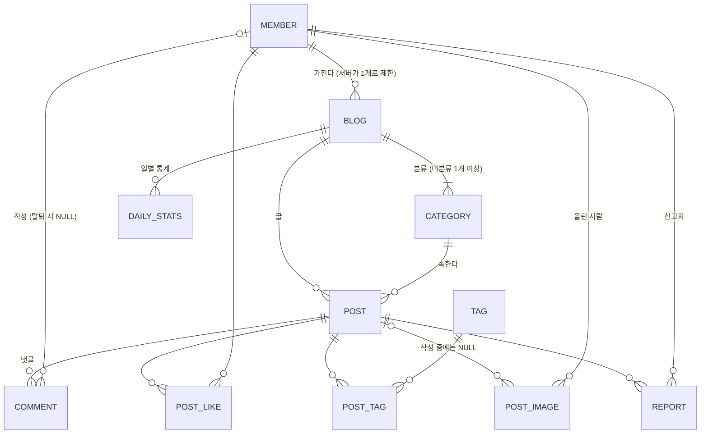

# Data Model: 개인 블로그 서비스 (MVP)

> spec의 Key Entities를 표와 칸으로 구체화한다. 타입은 PostgreSQL 기준 가안이다.
> 모든 표는 `id BIGINT` 기본 키와 `created_at TIMESTAMPTZ NOT NULL`을 가진다(아래 표에서는 생략).
> 시각은 UTC로 저장하고, 날짜 계산(통계, 하루 제한)은 `Asia/Seoul` 기준이다.
> 문자열 길이는 "글자 수" 기준이며 서버에서 검사한다. DB 칸 길이는 여유 있게 둔다.

## 관계 한눈에 보기

## member (회원) — FR-001~021

| 칸 | 타입 | 제약 | 설명 |
|---|---|---|---|
| email | VARCHAR(254) | NOT NULL, `UNIQUE(lower(email))` | 소문자로 저장, 변경 불가 |
| nickname | VARCHAR(10) | NOT NULL, `UNIQUE(lower(nickname))` | 2~10자, 한글·영문·숫자 |
| bio | VARCHAR(100) | NULL | 소개 0~100자 |
| password_hash | VARCHAR(100) | NOT NULL | BCrypt |
| failed_login_count | SMALLINT | NOT NULL DEFAULT 0 | 로그인·현재 비밀번호 오입력 합산 |
| locked_until | TIMESTAMPTZ | NULL | 이 시각 전에는 로그인 불가 |
| updated_at | TIMESTAMPTZ | NOT NULL | |

- `created_at`이 가입일(FR-016).
- 상태: 정상 ↔ 잠금(`locked_until > now`). "인증 전" 상태는 없다(인증해야 만들어짐).
- 탈퇴하면 행을 지운다(research R-14).

## blog (블로그) — FR-022, FR-049

| 칸 | 타입 | 제약 | 설명 |
|---|---|---|---|
| owner_id | BIGINT | NOT NULL, FK → member ON DELETE CASCADE | 서버가 회원당 1개로 제한 |
| name | VARCHAR(30) | NOT NULL | 1~30자, 기본 "{닉네임}의 블로그" |
| description | VARCHAR(200) | NULL | 0~200자 |
| comments_last_viewed_at | TIMESTAMPTZ | NULL | 댓글 관리를 마지막으로 연 시각 (R-13) |
| updated_at | TIMESTAMPTZ | NOT NULL | |

- 지금은 `UNIQUE(owner_id)`를 걸지 않는다. 여러 블로그로 넓힐 수 있게 1:N 구조로 두고 서버에서 제한한다(원천 03 `구현 방식`).

## category (분류) — FR-023~026, FR-047

| 칸 | 타입 | 제약 | 설명 |
|---|---|---|---|
| blog_id | BIGINT | NOT NULL, FK → blog ON DELETE CASCADE | |
| name | VARCHAR(20) | NOT NULL, `UNIQUE(blog_id, lower(name))` | 1~20자 |
| sort_order | INT | NOT NULL | 작을수록 위, 추가 시 최댓값 + 1 |
| color_index | SMALLINT | NOT NULL | 정해진 색 목록의 순번, 추가 순서대로 자동 배정 |
| is_default | BOOLEAN | NOT NULL DEFAULT false | "미분류". 블로그당 정확히 1개, 삭제 불가 |

- 삭제 조건: 글이 1개 이상이거나 `is_default`이면 거절(FR-025). DB에서도 `post.category_id` FK를 `ON DELETE RESTRICT`로 둔다.
- 순서 바꾸기: 이웃한 두 분류의 `sort_order`를 맞바꾼다.

## post (글) — FR-027~037

| 칸 | 타입 | 제약 | 설명 |
|---|---|---|---|
| blog_id | BIGINT | NOT NULL, FK → blog ON DELETE CASCADE | 작성자 = 블로그 주인 |
| category_id | BIGINT | NOT NULL, FK → category ON DELETE RESTRICT | |
| title | VARCHAR(100) | NOT NULL | 1~100자, 앞뒤 공백 제거 |
| body | TEXT | NOT NULL | 마크다운 1~10,000자 |
| visibility | VARCHAR(10) | NOT NULL DEFAULT 'PUBLIC', CHECK IN ('PUBLIC','PRIVATE') | |
| view_count | BIGINT | NOT NULL DEFAULT 0 | 누적 조회수 (FR-050) |
| updated_at | TIMESTAMPTZ | NULL | 내용이 바뀐 수정 때만 갱신 (FR-028) |

- `created_at`이 작성 시각. 정렬은 `(created_at DESC, id DESC)`로 "같은 시각이면 나중에 만든 글이 위"를 지킨다(CF-10-1).
- 색인: `(blog_id, visibility, created_at DESC, id DESC)`, `(category_id, created_at DESC)`, 전체 공개 글 검색용 `(visibility, created_at DESC)`.
- 이전/다음 글: 같은 블로그의 공개 글 중 `(created_at, id)`가 바로 앞·뒤인 것.
- 작성자 = `blog.owner_id`이므로 글에 작성자 칸을 따로 두지 않는다.

## comment (댓글) — FR-038~039, FR-048~049

| 칸 | 타입 | 제약 | 설명 |
|---|---|---|---|
| post_id | BIGINT | NOT NULL, FK → post ON DELETE CASCADE | |
| author_id | BIGINT | NULL, FK → member ON DELETE SET NULL | NULL이면 "탈퇴한 사용자" |
| content | VARCHAR(500) | NOT NULL | 1~500자, 줄바꿈 허용 |

- 색인: `(post_id, created_at)` 상세 화면용, 댓글 관리용으로 블로그 기준 최신순 조회(`post.blog_id` 조인 + `created_at DESC`).
- 내 블로그 안의 내 댓글은 블로그 삭제 → 글 삭제로 함께 사라진다(FR-019).

## post_like (좋아요) — FR-040

| 칸 | 타입 | 제약 |
|---|---|---|
| post_id | BIGINT | NOT NULL, FK → post ON DELETE CASCADE |
| member_id | BIGINT | NOT NULL, FK → member ON DELETE CASCADE |

- `UNIQUE(post_id, member_id)`. 자기 글 금지는 서버에서 검사.

## tag / post_tag (태그) — FR-041

| 표 | 칸 | 제약 |
|---|---|---|
| tag | name VARCHAR(15) | NOT NULL, `UNIQUE(lower(name))`. `#` 제거, 공백·쉼표 불가 |
| post_tag | post_id, tag_id | PK(post_id, tag_id), post 쪽 ON DELETE CASCADE |

- 글당 최대 5개는 서버에서 검사. 아무 글에도 연결되지 않은 태그는 남겨 둬도 된다.

## report (신고) — FR-042

| 칸 | 타입 | 제약 | 설명 |
|---|---|---|---|
| post_id | BIGINT | NOT NULL, FK → post ON DELETE CASCADE | |
| reporter_id | BIGINT | NOT NULL, FK → member ON DELETE CASCADE | |
| reason | VARCHAR(20) | NOT NULL, CHECK IN ('SPAM','ABUSE','ADULT','ETC') | 스팸 / 욕설·혐오 / 음란물 / 기타 |
| detail | VARCHAR(200) | NULL | 기타 설명 0~200자 |

- `UNIQUE(post_id, reporter_id)`. 처리 상태 칸은 관리자 기능과 함께 나중에 더한다.

## post_image (글 이미지) — FR-043

| 칸 | 타입 | 제약 | 설명 |
|---|---|---|---|
| post_id | BIGINT | NULL, FK → post ON DELETE CASCADE | 작성 중에는 NULL (R-08) |
| uploader_id | BIGINT | NOT NULL, FK → member ON DELETE CASCADE | |
| storage_key | VARCHAR(100) | NOT NULL UNIQUE | 서버가 만든 UUID 파일 이름 |
| content_type | VARCHAR(20) | NOT NULL | image/jpeg, png, gif, webp |
| size_bytes | INT | NOT NULL, CHECK ≤ 5MB | |

- 글당 10장은 서버에서 검사. 행을 지우면 저장소 파일도 지운다(트랜잭션 후).

## daily_stats (일별 통계) — FR-045, FR-050~051

| 칸 | 타입 | 제약 |
|---|---|---|
| blog_id | BIGINT | NOT NULL, FK → blog ON DELETE CASCADE |
| stat_date | DATE | NOT NULL (한국 시간 날짜) |
| view_count | INT | NOT NULL DEFAULT 0 |
| visitor_count | INT | NOT NULL DEFAULT 0 |

- `UNIQUE(blog_id, stat_date)`. 누적 = 합계. 일별 댓글 수는 `comment.created_at`으로 센다.
- 데이터가 없는 날은 0으로 채워 그래프를 그린다.

## 표 밖의 데이터

| 데이터 | 위치 | 참고 |
|---|---|---|
| 로그인 세션 | PostgreSQL `SPRING_SESSION`, `SPRING_SESSION_ATTRIBUTES` (Spring Session 기본 표) | R-01 |
| 인증번호·제한·인증됨 표시 | Redis `verify:*` | R-04 |
| 조회수 중복·방문자 하루 1번 | Redis `view:*`, `visit:*` | R-12 |
| 댓글 5초 제한 | Redis `comment-cooldown:*` | R-15 |
| 이미지 파일 | MinIO 버킷 또는 서버 디스크 | R-08 |

## 삭제가 퍼지는 방식

| 지우는 것 | 함께 지워짐 | 남는 것 |
|---|---|---|
| 글 (FR-030) | 댓글, 좋아요, 태그 연결, 이미지 기록·파일, 신고 | 태그 이름 |
| 분류 | — (글이 있으면 거절) | |
| 회원 탈퇴 (FR-019) | 블로그 → 분류·글(→ 위 항목)·일별 통계, 내가 누른 좋아요, 내가 한 신고, 내가 올린 이미지, 모든 세션 | 남의 글에 단 댓글(작성자 NULL) |
